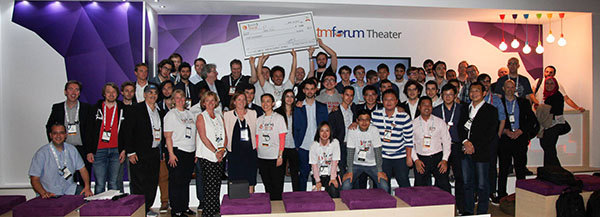

# Welcome Web Technologies CDA404
Welcome to Web Technologies, delivered by me Joe Appleton! As the name suggests this unit will be introducing you to the technologies used to power web-based applications. 
Globally the internet has become intertwined in our lives. I see the internet as a platform for delivering sophisticated applications. Furthermore, on a philosophical level, I see software applications as a means to solve problems.  Herein lies is why the internet from a developers perspective is such an exciting prospect. We get to solve problems (write applications) and distribute to the global platform that is the internet.
  
  
# Teacher and Teaching Focus 

In order to gain a better understanding of how to learn on this particular unit, firstly I must briefly introduce myself and my teaching approach. While this unit is all about you the learner,  it is necessary to very briefly introduce my skill-set.
 
## Joe Appleton 

- Lecturer in Programming  for 3 years (web)
- PhD Student at Lancaster University (Research Interest - Technology Enhanced Learning)
- 10 years industry experience specialising in programming web applications
- Currently involved in several technical web projects
- [Showcased Programming Skills in Winning A Global Hackathon](https://www.solent.ac.uk/news/school-of-media-arts-and-technology/2017/computing-team-take-first-place-in-international-programming-competition)
 
## My Teaching Style 

When teaching a topic such as web technologies, it's very tempting to overly focus on tools. This is the approach that I indeed took in my early lecturing career. However, what differentiates university from technical training is that as graduates we should not only know the latest tools but also appreciate the ethical and theoretical underpinning of our subject. To that end, I shall be, where possible, attempting to focus on theory in the lectures and tools in the practicals. 

Theory without application is of little use. We will therefore apply the theory in the practicals and assignments. 

While I am providing a basic scaffolding for your learning, the style in which I do so may be different from what you're used to in school or college. I believe you construct your own knowledge and learn socially ({{"Bandura1977" | citeNoBraces}}). I encourage all of you to interact in person and social media and learn together. My job as a teacher is not directly to provide you with knowledge but rather guide you in finding things out yourself. 

# Theories 

Throughout this course you I will be introduced the below theories which are vital to understand when constructing web application:

- The Importance of Workflow 
- Creative Commons 
- Colour Theory  
- Grids and Design Ratios 
- Ethics, Accessibility and Data Protection 

We will apply the above theories to make websites with the below tool set:

# Key Tools 

- GitHub & Git Hub  (Version Control)
- HTML 5
- JavaScript 
- CSS

# Reading List 

## Block 1 

### To understand the history of version control 
Rochkind, M. J. (1975). The source code control system. IEEE Transactions on Software Engineering, (4), 364–370.

Ruparelia, N. B. (2010). The History of Version Control. https://doi.org/10.1145/1668862.1668876

### If you are interested in the theories behind my teaching style

Bandura, A., & Walters, R. H. (1977). Social learning theory (Vol. 1). Prentice-hall Englewood Cliffs, NJ.

##Block 2

### If you are interested in learning a bit more about media ownership rights 

[https://www.smashingmagazine.com/2011/06/understanding-copyright-and-licenses/]

# Full Reference List



