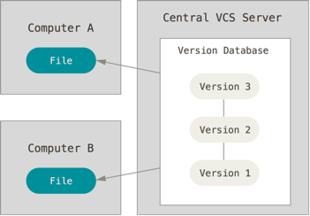
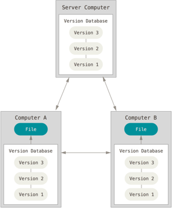

# Distributed Vs Centralised Version Control

- So far we've only looked at VCSs that keep a revision history on the developers local computer. Perhaps you've already considered some the glaring issues! 

 - **What happens if your local computer goes down?** 
 - **How do we collaborated with other developers on the same project?**

## Centralised version control

 
 

 <cite>Figure 4 - Centralised Version Control  </cite>

 
- The first proposed solution to the above problem was to place the VCS on a centralised server (see Figure 4). Developers would check out individual files and work on them locally. After making changes they would check the file back into the remote server. While this configuration allows collaboration it still has the major downside that the entire project is kept in a single location. A single location of course means exposure to a single point of failure.  

## Distributed version control 

 
 

 <cite>Figure 5 - Distributed Version Control  </cite>

- A distributed version control system such as GIT solves the aforementioned problems. In such systems developers don't just check out single files or the latest snap shot of the project rather they fully mirror the project and all of its revisions. Should the server or any other computer die, then anyone who's working on the project has a full history. 

