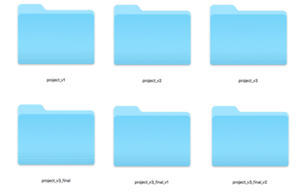
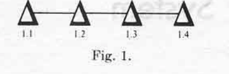

# Version Control

- Version control is simply a workflow that involves keeping historic versions of our work. In fact you may well have already implemented your own version control system by keeping multiple versions of your work in different folders (see Figure 2)

<cite> Figure 2 - A Manual Version Control Workflow </cite>

- The above method is very ineffective! Firstly, we don't know exactly what has changed in each version. Secondly, we may accidentally write to the wrong folder or forget entirely to make our backups

- Version Control Systems (VCS) automate the process of controlling versions our work. The first VCS was developed by Marc Rochkind in 1975 while working at Bell Labs ({{"Rochkind1975" | citeNoBraces}})

<cite> Figure 3 - Changes Graph </cite>

- Rockind proposed that rather than keeping full duplicates of the project we should only keep copies of the changes. These changes are linked together in a graph/tree like structure. Firstly, this significantly saves on space (which was a  premium at the time) as we only store our changes and not complete versions of our work. Secondly, having the changes in a graph like structure allows navigation of the graph and the ability to roll our work back or 

- One of the first widely used VCS was RCS **(insert citation)**. Developers would **check files into the RCS** to put them under version control. When a developer wanted to work on a given file that specific file would be individually **checked out** to work on. Changes are logged in a graph like structure proposed by Rockind.  

