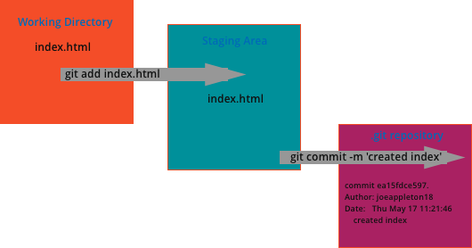

# Version Control Using Git

- Recall that early VCSs tracked the changes in files storing them in 
a graph like structure. 

- GIT differs from traditional version control systems in that it stores an  entire copy of files as they change. It's in effect an automation to the manual process of manually duplicating the project and storing it in multiple folders.

- As we have a complete history of our files over time. GIT allows us to make changes without worrying if we break things. We can simply roll back to earlier versions of our work. 
 
 
 ## GIT Workflow

 
 
 
 <cite> Figure 6 - A Simple Git Workflow </cite>

 
 
- Figure 6 is a visual representation of a simple git workflow. 

       - One or more files are firstly staged for commit 
       - Once the commit is ready a snap shot is taken in the form of a `commit` . A programmer defined message is attached to the commit describing the changes
       - That's it! It really is that simple at least to start with. For now just be aware that you can recover historic versions of your work. However, to keep things simple we won't be looking into file recovery until later in the unit. What's key at this point is you become comfortable with the basic GIT workflow. 
