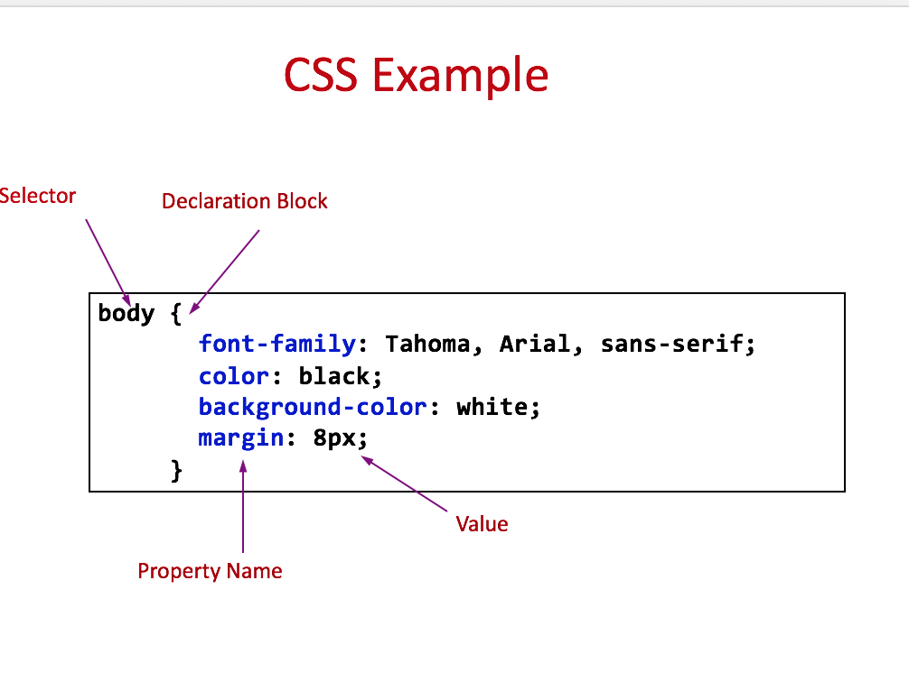

# Practical  2 Laying Out A Website


This week we're introducing the concept of cascading styles sheets (CSS). 


# Practical 1

The first part of the practical introduces you to the basics of laying out websites. 

<iframe width="560" height="315" src="https://www.youtube.com/embed/BB0R9CL4DyQ" frameborder="0" allow="autoplay; encrypted-media" allowfullscreen></iframe>


Make sure your HTML is valid using the W3C validator. [https://validator.w3.org/](https://validator.w3.org/).  


# Practical 2 


>> The food landing page, this is just for reference. Use mock_up_start_here.png as as your main guide 

- This is going to be a larger extended project which will last 2-3 weeks.


- Using the notes below, you are going to work out how to lay out the  Foody landing page. 

- <a href="https://github.com/joeappleton18/web_technologies_notes/raw/master/blocks/section1/2_the_web_what_it_is_who_owns_it/assets/web_project.zip" download>Download the detailed mock up </a>

- Using external CSS implement the mock up to the best of your ability. 


# Practical 2 Notes 

##Extending HTML and Introducing CSS

###Block level elements 

- Block elements form a separate block of HTML
	- they can be contained within other block elements
	-  the following tags are all block level elements 
		
	```html 
	
			    <p>…</p> 
 				<h1>…</h1>
				<table>…</table> 
	```
	
	- A block level element takes up the entire space of its container
	
	- except for the p element, they can contain other block elements
	
	
###Inline elements
	
- Inline elements stay in line with the rest of the content
	- They can only contain other inline elements, but may be contained by both inline and block elements
	- The following tags are inline elements:
	 
 ```html	
 	…</img>
	<a>…</a>
```

###HTML `<div>` Tag


- Defines a division or a section in an HTML document
- Used to group elements to format them with styles

```html 
<body>
	<div id=“wrapper">
		<div id="header”>
       	…… 
		</div>  <!- - [end]#header - -> 
		<div id="section”>
      		……
		</div> <!- - [end]#section - -> 
		<div id="footer”>
        …….
		</div><!- - [end]#footer - ->
	</div> <!- - [end]#content - ->
</body> 
```
 
###HTML `<span>` Tag  

- Provides a way to add a hook to a piece of text or a part of a document, e.g. 

`<p>She has <span class="blue">light blue</span> eyes.</p>`

>> The difference between span and div is that a  span element is inline and often used for a small section of HTML, whereas a div element is used to group larger chunks of code

###class and id Attributes


- class specifies the element as a member of one or more classes 
allow developers to define specific kinds of a given element
     
 `<element class="classname">`

- id specifies a unique id for an HTML element, **can only be used once**

  `<element id="id">`
  
  
##Introducing CSS
  
Cascading style sheets allow us to separate the content of our website from the appearance:
  
- Multiple developers can work on different aspects of the web site development
- Makes your web site quicker to update
- Smaller file sizes and good for search engine optimisation
- Helps browsing from different devices 

###What is CSS

- CSS stands for Cascading Style Sheets 
- Styles define how to display HTML elements
- Two main parts: a selector and one or more declarations




##Selectors

- We can target selectors in different ways:

- Element selectors
   - name of an HTML element, e.g. `p`
   - Grouping selectors together  
the same style applies to all elements, e.g. 
`h1,h2,h3,h4,h5,h6`  
- class selectors
   - “.” followed by the value of the class, e.g. 
   - .unit or p.unit
- id selectors
   - “#” followed by the id name, e.g. #itech

##How is CSS Used?

Although we can use inline, internal styles, always try and use an
**external** CSS file. Linked in like this:

```html
<head>
<link rel="stylesheet" type="text/css" 		href="mystyle.css"/>
</head>

```


##Extending the knowledge of CSS selectors

-  We can have different types of selectors 
-  Element names as selectors
	
	```html 
		p {   
     		color: red;
		}
	```
	
- 	If we want we can group selectors together. For instance, we might want all our headings to be grey

	```html 
		h1, h2, h3, h4, h5, h6 {
			color: grey;	
		} 
	
	```
	
- We can have class `.` and id selectors `#`

	```html 
	.section {
		font-size: 20px;
	}
	
	#footer  {
		font-size: 10px;
	}
	
	```	
	
##CSS Pseudo-elements
	
- Rather than having to apply class and id's to elements, we can save ourself time by targeting them using an elements children by using a `pseudo-element` 

	```html 
        h1:before {
          	content:url(smiley.gif);
           
       }
	
	```
	
	```html 
		p::first-letter {
    		color: #red;
    		font-size: xx-large;
      }
	
	```
	
##CSS Pseudo-classes

- We can use these CSS classes to add special effects to elements themselves or a special state of the element 


- `:hover` the user has the mouse over the element  

- `:active` the element is being activated (e.g. clicked)

- `:visited` a link has been visited

- `:focus` the element has the keyboard as its focus


#Basic Page Layout

##CSS display Property

- CSS has two main ways of displaying elements
	
	-	`display: block`

	-	`display: inline`
- An image is a inline element by default, however often you want an image to display on it's own line. In this case we can change the `display` property to `block`
- For example, here's how we centre align an image:
	
	```html 
	.displayed {
		 display: block; 
		 margin-left: auto; 
		 margin-right: auto;
	 }
	```
- We can then assign the display class to an image:

	```html
	
	```
- We can also use the shorthand margin property to achieve the same result:

	```html
	img.displayed 
	{  
		   display: block;
   		margin: 0 auto;  
	}
	```
	
##Margins

- Margin values can be specified either on all sides or on individual sides

- single value for each margin: top, left, bottom and right, e.g. `margin:10px;`

- two values: 1st=top & bottom; 2nd=left & right, e.g. `margin:10px 5px;`

- four values: top, right, bottom and left, e.g. `margin:10px 5px 15px 20px;`

##Width and Height

- The width and height properties can be specified using percentage or length values (e.g. pixels or %)

- Specifying widths of elements in % means they will will shrink or grow so they are always in scale with the screen size  

	```html 
	 p {width: 40%;}
		
	```		 

##Position Property

```	
	selector {
		position: <value>
	}

```


- static – **default value**  i.e. elements are laid out in the normal flow

- relative – an element is moved relative to its place in the normal flow according to its top and left values

- absolute – an element is taken completely out of the flow and then positioned with respect to the top and left of the first element that contains it. Used for sticky footers, try to avoid in any other case. 

- fixed – an element remains exactly where it is when the page is scrolled


##Default static position of 2 DIVS


```
#wrapper{
width: 80%
}
#box1 {
     width: 20%;
}
#box2 {   
   width: 20%;   
}
```

##Adding a float left 

````
#wrapper{
width: 80%
}
#box1 {
     width: 20%;
  float: left;
}
#box2 {   
   width: 20%; 
   float: left;   
}
````


##Adding a float to the left and right

```
#wrapper{
width: 80%
}
#box1 {
     width: 20%;
  float: left;
}
#box2 {   
   width: 20%; 
   float: right;   
}
```

	


