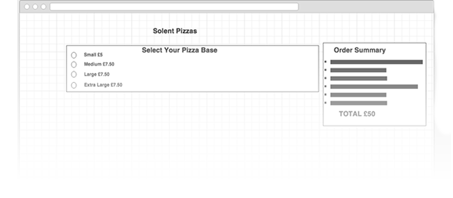

# Wireframe Mock Up's

It's tempting to jump straight in and start experimenting with HTML, designing the form as we go along. However, making design tweaks and experimenting with different layouts using HTML and CSS is time consuming.

* Therefore, it's common practice to plan the layout of HTML pages using a wire frame. A wire frame allows us to focus purely on the layout of our pages, filtering out the finer more time consuming design choices. 

Wire frames can be created:

* By Hand
* Using a drawing tool such as photoshop
* Using one of the many online wire framing tools

# You'll need to create low fidelity wireframes for your assignment 