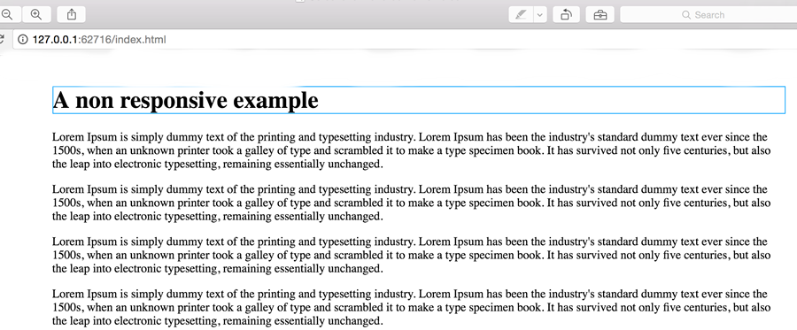

# The Viewport 

**One of the most important concepts in responsive design**

- Viewport is **the display** through which we **view a website**
- You may recall form internet tech we would assumed that we were building our sites for a display with a width of 980px. Historically this was the typical minimum monitor/viewport size.

##Viewport is simple when it comes to desktop browsers

The viewport is the same size of the browser. When we make the browser small the viewport becomes smaller.

##When it comes to mobile devices things are't quite as simple

>> The same site as above on a mobile, we can still see all the content but it's very small!

Typically on a mobile the viewport is set larger than the device, then entire view is scaled down to fit the device. This ensures the entire page is shown, the problem with this is the content will become very small.

 

