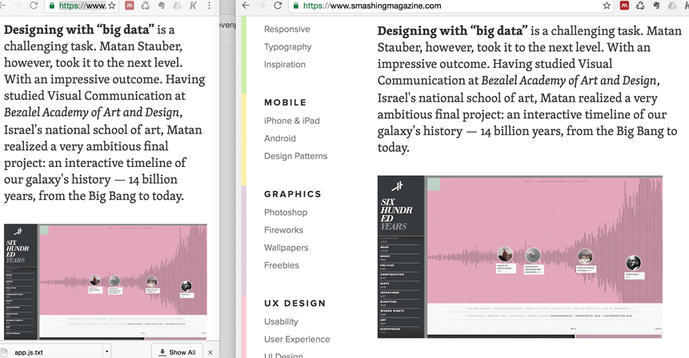

### Breakpoints 

>> Notice on the smaller view of smashingmagazine.com on the left a breakpoint is triggered and the menu is removed

* Along with the viewport, breakpoint are also a fundamental of responsive design. 

* A breakpoint is the point at which a website changes layout based on the width of the viewport. 

* Common breakpoints:
  - Extra small devices, for example, Phones (<768px)
  - Small devices, for example, tablets (3768px and <992px)
  -  Medium devices, for example, desktop computers (3992px and <1200px)