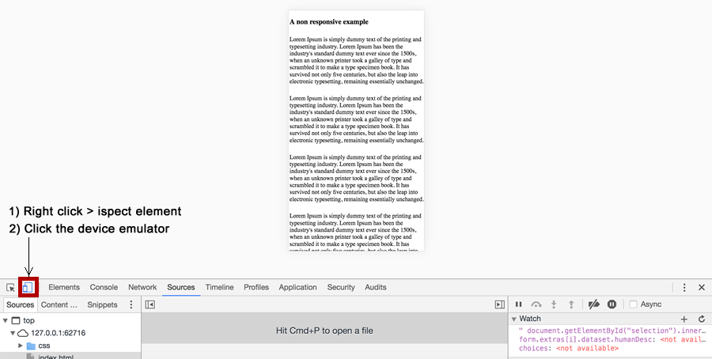

# Testing Responsive Websites

In order to test responsive websites we need to view the site trough a variety of different devices. Although using actual different physical device is a legitimate test strategy, taking  such an approach in our day to day development workflow is not feasible. 

Chrome developer tools offers a handy bit of functionality that allows us to simulate different devices. 

- Simply right click on the website you want to test and select **inspect element**	
- Click the device emulator
- Elect which device you want to emulate from the drop down that will appear at the top of the screen

