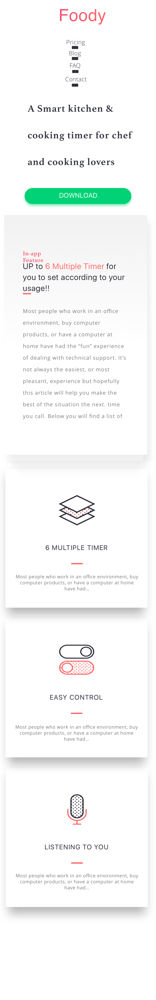

# Practical Responsive Website Design 

<iframe width="560" height="315" src="https://www.youtube.com/embed/hR9eDirLcpU" frameborder="0" allow="autoplay; encrypted-media" allowfullscreen></iframe>

>> Responsive web design tutorial 

- At this juncture you should have laid out the foodie website. If you have not done this [re-visit the task](../2_the_web_what_it_is_who_owns_it/practical.md)

- We are now going to make this website responsive. Use a single breakpoint of 'max-width: 700px', anything below this width should be considered a mobile device. The image below will give you an idea of what we are trying to achieve.   Notice how we are hiding unimportant elements such as the phone image. 

