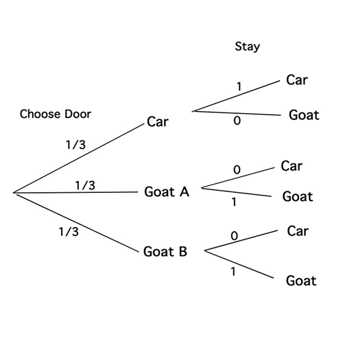
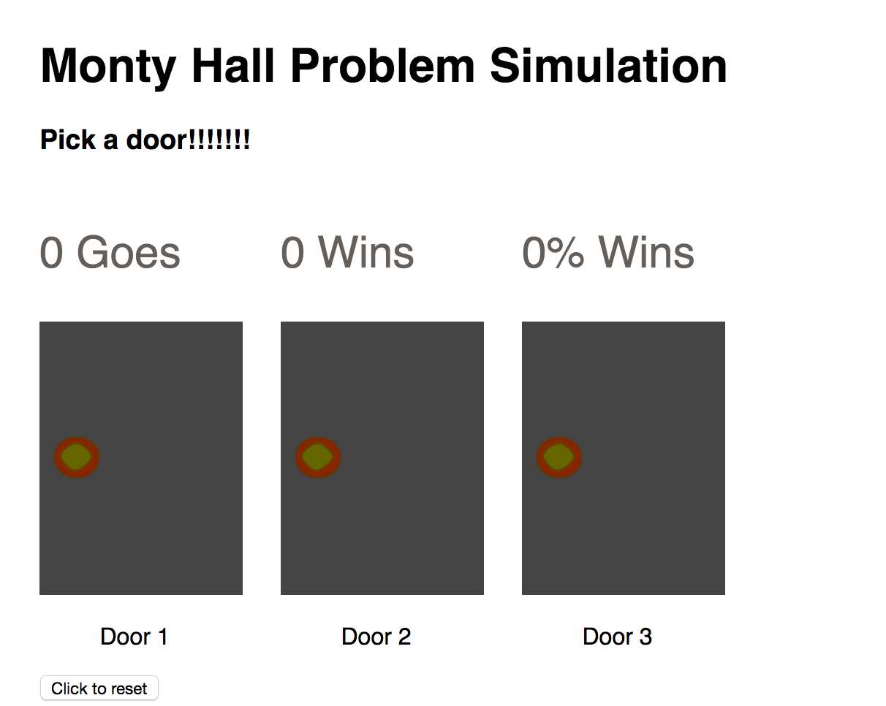

#Exercise  - The Monty Hall Problem

In the session we're going to build a monty hall problem simulation. **Note**, this is a challenging task. **If you complete it please send me a link to your solution on gitHub** . Don't worry if you can't complete the solution, you'll learn lots just attempting it. 

## The Problem 

>> Suppose you're on a game show, and you're given the choice of three doors:
Behind one door is a car; behind the others, goats.
You pick a door, say No. 1, and the host, who knows what's behind the doors, opens another door, say No. 3, which has a goat.
He then says to you, "Do you want to pick door No 2?" Is it to your advantage to switch your choice?

####It turns out you're twice as more likely to win if you switch doors




##1 Setup 

Download the starting files from **here**


##2  Identify the elements 


>> yours won't look like this until after we run the set game function

In `index.html` add `id` attributes with appropriate names to:

- Door1, Door2, Door3 images , they currently do not have a source we'll sort that out next
- The reset button
- Goes wins and %wins
- The question, which currently contains "Pick a door!!!!!!"

##2 Start the main function
Open `main.js` notice how we have the following variables defined at the top of the page:

``` 
   var door1; 
	var door2; 
	var door3;
	var question;
	var prize_door;
	var current_go = 1;
	
```
 
The above are global variables, this means they're accessible from any location in the program. 
 
Within the `main()` function assign the `door image` elements to each of the door vars and also for the question. For example `door1` is the id of my first image:
 
 `door1 = document.getElementById('door1');`
 
You should set assign elements to the following vars:

```
door1 =  ... 
door2 =  ...
door3 =  ...
question = ...

```
 
##3 Complete the setUpGame() function 

The `setUpGame()` gets the game ready it is called after we assign elements to our door and question variable. Firstly, it generates a random number between 1 and 3. Next, it sets the `src` of each of our door images.  

- Set the `src` of each of the doors to `img\door.png`

**Run your webpage, it should now look like the above image**

- The below creates a random number between 1 and 3 and assigns it to the variable  

```
var prize_door_number = Math.floor(Math.random() * 3) + 1;

```

- See if you can set up some logic after this line of code that does the following: 

Sets the global variable prize door, conforming to the following conditions:

```
prize_door_number  == 1  then prize_door = door1
prize_door_number  == 2  then prize_door = door2
prize_door_number  == 3  then prize_door = door3

```

##4 Add click events to each of the doors

- Within `main()`, add click events to each of the doors. Calling `door1click()`,`door2click()` and `door3click()`.
- Place a `console.log()` in each of the functions, so you know they are working


##5 Complete the basic game play logic

- To start with, we'll make the first choice in our head. The second choice will be maid by clicking

- For each of the door click functions check if that door equals the prize door. If it does display the car image otherwise display the goat.    For example, `if(prize_door == door1)`  will return true if `door1` is the randomly chosen door. 


- Choose a way to notify if the use has won or lost

- Increase the go by 1 for each guess.


##6 Add a click event to the reset button

Add a click event to the reset button so it runs `setUpGame()`


##Complete the remaining functionality

It's mostly up to you to work this out. Please implement the following functionality 

- Update the question so on every second go it asks you if you want to switch or stick. Only revealing the prize after this choice has taken place. 
>> Hint, use the modulo function to differentiate between odd and even goes 

- Update the stats 

**If you get this far email your git hub solution**

 

 