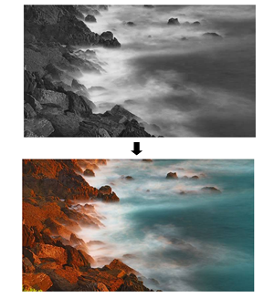

#javaScript Image Roll Overs 

Having an image change colour or appearance when a user hovers over it can be a useful effect in web design. It's a way to reinforce the user's recognition that certain page elements are alive and clickable.  Let's consider how we might achieve this effect using javaScript:

```html	
...

<body onload="main()">
    
	
    
</body>

...

```
```javascript
//global var
var image;
//main function runs on page load 
function main(){
    //get  a reference to the image, notice how we don't use var
    image = document.getElementById("oceanImage");
    //add event listeners to the image 
    image.addEventListener("mouseover", mouseOver); 
    image.addEventListener("mouseout", mouseOut); 
}

function mouseOver() {
    //update image src attribute
    image.src = "img/ocean.jpeg";   
}
 

function mouseOut() {
   //update image src attribute
  image.src = "img/ocean_grey.jpg";      
}

```
#The Effect On Mouse Over



### mouseOver and mouseOut events 

* In order to achieve the above effect we've used two new event listeners, `mouseover` and mouseout`. 
* The `mouseover` event fires when the cursor is over the image. 
* The `mouseout` event fires when the mouse leaves the image.
## `image.src` property   
* We can then react to these events and update the `src` attribute using `image.src = "new image location";   `


	