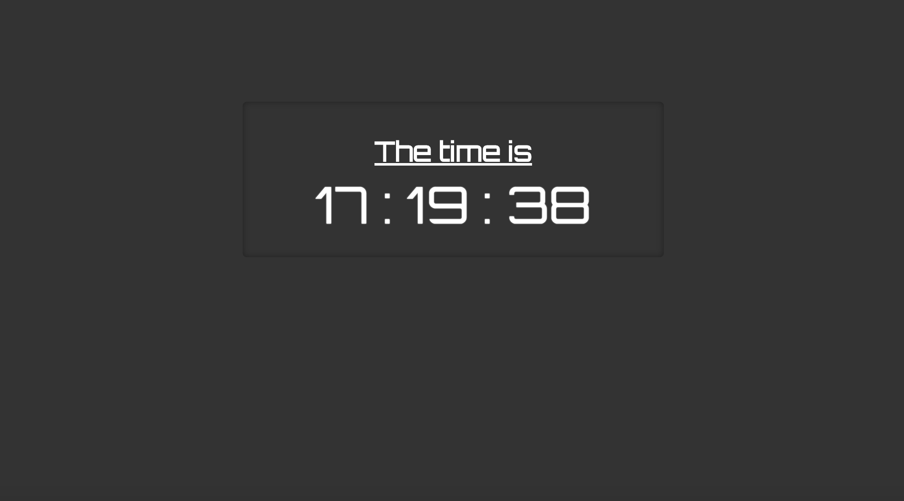
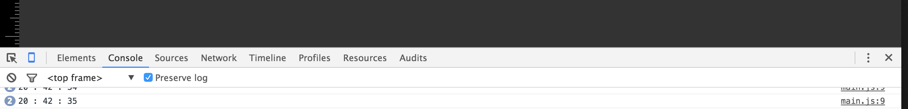

# Exercise A javaScript clock

We're going to use everything we've learnt so far to implement a simple javaScript clock.  It's also going to be an opportunity to refresh your HTML skills along the way.

## 1\) Create An HTML Template

First things first, make an HTML template that will form the foundation of our clock. Create a file called index.html and create your layout.  Here's what mine looks like:



Make sure that you have a neat folder structure and place your `css` rules  
in an external `.css` file.

## 2\) Implement the javaScript date object

**You'll need this for your assessment**

1\) Create a javascript file called `main.js` and place it in a a folder called scripts.

2\) [Include the external js file into your HTML page](external.md))

3\) Set up an onload event in your html file to call a function called `main()` within your HTML's document's `<body onload="main()">` tag.

4\) In order create a clock the first thing we need to do is get the current time. Luckily, javaScript has a handy [date](http://www.w3schools.com/jsref/jsref_obj_date.asp) object we can use.

```javascript
// set up a new date object 
  var today = new Date();
  //extract the hour min and seconds and store them in a variable 
  var curr_hour = today.getHours();
  var curr_minute = today.getMinutes();
  var curr_second = today.getSeconds();
```

Include the above code into your `main()` function.

2\) In your `main` function, declare a variable `curr_time` and assign it the concatenated values of  curr\_hour , curr\_minute and curr\_second  separated by a ":".

Add the instruction `console.log(current_time);` in your `main()` function, this will print the value of current time to the console.  
You should see something similar to below in the google chrome developer tools console.



## 5\) Attache the time and date to the HTML document

Using `docment.getElementeById("insertid").innerHtml =` insert the current time into your HTML clock.

## 6\) Let's start time

Currently  the only way to get the up to date time is to refresh the page, this is not ideal.  Lets fix this:

1\) Create a `<button>` below the clock and give it an ID.

2\) Within the **main.js**  `main` function add an event listener that calls a function `startTime` when the button is clicked.

3\) In order to actually make the clock tick, we need to repeatedly call the `main` function. To achieve this we can use the    `setInterval()` function:

```javascript
// call the function main every 500 mills
   setInterval(main, 500);
```

The above example will call the function `main()` every 500 milliseconds. Include something similar in your button click callBack function.

**Your clock should now update in real time, but only after the button is clicked**

**When your done show your tutor to check that you have implemented all of the concepts correctly**

