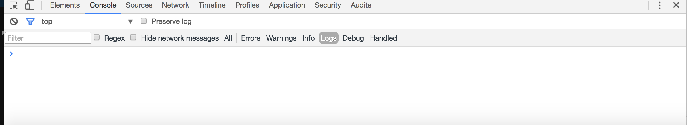
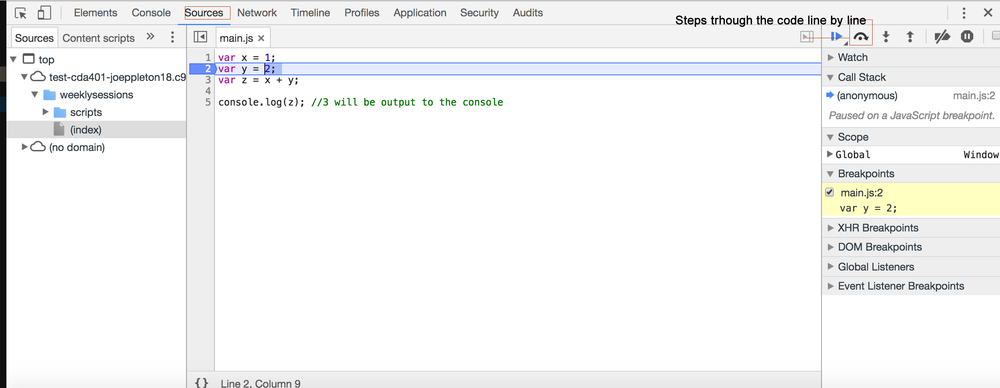

#Some useful tools 

- A good programmer should be able to create applications using the most basic of tools, such as  Notepad or TextEdit.  That being said, most professional javaScript developers use tools to assist in their every day workflow. 

##Chrome developer tools

- You may have already used developer tools before
- To access developer tools, right-click on any page element and then 
click `Inspect Element`.




- One of the most most useful feature of developer tools is it 
allows us to log diagnostic information to the console tab.
 
 ```html
 var x = 1;
 var y = 2; 
 var z = x + y;
 
 console.log(z); //3 will be output to the console
 ```
- We can also add what's know as a breakpoint. A breakpoint will pause your javaScript code and allow you to visually step trough. This is great for debugging:


>> To set a break points, click Sources -> Select Your File -> Click in the margin where you want the javaScript to pause -> Refresh the page

    
#Integrated Development Environment

>> "An Integrated Development Environment (IDE) is a software application that provides a programming environment to streamline developing and debugging software."

- There lots of IDE's for the web, some of my favourite free ones are:

- [Atom](https://atom.io/)
- [Komodo Edit](http://www.activestate.com/komodo-edit)
- [Brackets](http://brackets.io/)

**Paid options**

- [Sublime](https://www.sublimetext.com/)
- [Webstorm](https://www.jetbrains.com/webstorm/)

If you have a laptop/home computer you should try out some of the above IDE's and pick your favourite. However, with regards to this course, we've opted to advocate the browser based id [https://c9.io/](https://c9.io/)

##Cloud9   

 [https://c9.io/](https://c9.io/) provides a pre-configured development environment in the cloud. All of the tools that we need for this course are already set up. 
 
 