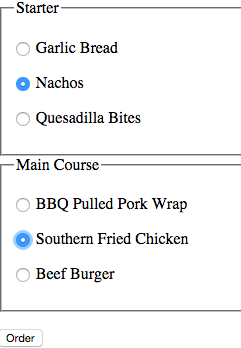

#Accessing a Radio boxes

You've already seen how to access the value of form text inputs, we can use the exact same technique to access the selected value of a radio box. 

```html
        <form id="orderForm">
            <fieldset>
                <legend>Starter</legend>
                <p><input type="radio" name="starter" value="bread" data-price = "1" > Garlic Bread</p>
                <p><input type="radio" name="starter" value="nachos" data-price = "2"> Nachos<p>
                <p><input type="radio" name="starter" value="quesadilla" data-price = "3"> Quesadilla Bites<p>
            </fieldset>
            <fieldset>
                <legend>Main Course</legend>
                <p><input type="radio" name="main" value="pork"> BBQ Pulled Pork Wrap</p>
                <p><input type="radio" name="main" value="chicken"> Southern Fried Chicken</p>
                <p></p><input type="radio" name="main" value="burger"> Beef Burger </p>
            </fieldset>
        </form> 
```



```javascript

var orderForm = document.getElementById("orderForm")
var starter = orderForm.starter.value;
var main = orderForm.main.value;
console.log(starter);  //will output nachos
console.log(main); // will output chicken

```
 