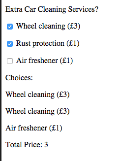

#Encoding information into elements 

```html

<form  id="carCleaning">
            <p>Extra Car Cleaning Services?</p>    
            <p><input type="checkbox" name="extras" value="wheelCleaning"> Wheel cleaning (£3) </p>
            <p><input type="checkbox" name="extras" value="rustProtection">  Rust protection (£2) </p>
            <p><input type="checkbox" name="extras" value="airFreshner">  Air freshener (£1) </p>
</form>


```
Consider the above form example again, one of the challenges we have is that we don't have much descriptive information regarding each element in our checkbox group.  `document.getElementById("carRental").extras[1].value()` would return `wheelCleaning` but what if we wanted information about the price, or even a more human readable value?

#The data attribute

The data attribute allows us to add further descriptive information to a html element it's prefixed with 'data-' and the postfix must be lower case. We can then access value using the javaScript dataSet attribute. 

There are a few conventions that we must follow:

* Separate words for the dataset attribute must be separated using a `-`. e.g.  data-human-desc
* When we reference the data-attribute in javaScript we use camel case e.g. `form.extras[0].dataset.humanDesc `
<div id="example"> </div>

```html
....
<form  id="carCleaning">
            <p>Extra Car Cleaning Services?</p>    
            <p><input type="checkbox" data-price="3" data-human-desc="Wheel Cleaning" name="extras" value="wheelCleaning"> Wheel cleaning (£3) </p>
            <p><input type="checkbox" data-price="3" data-human-desc="Rust Protection" name="extras" value="rustProtection">  Rust protection (£2) </p>
            <p><input type="checkbox"data-price="3" data-human-desc="Air Freshner" name="extras" value="airFreshner">  Air freshener (£1) </p>
</form>

...
```
<p id = "total"> </p>  

Given the above form we could, use the `onChangeEvent` and provide the user with real time updates

```javascript 
  function main() {
    
    var form = document.getElementById("carCleaning");
    form.addEventListener("change", formChanged);
  
  }
  
  
  function formChanged(event){
	 var total = 0; 
     var choices  = ""
     
     
     
     for(var i = 0; i < form.extras.length; i++) {
        
         if (form.extras[i].checked){
            //convert the data attribute value from a string to a int
            itemPrice = parseInt(form.extras[i].dataset.price );
            //update total 
            total = total + itemPrice;
            //concatinate the new choice to our choices string 
            choices = choices + "<p>" + form.extras[i].dataset.humanDesc   +  "<p>")
         }
     }
       
        //update the display 
        document.getElementById("choices").innerHTML =    choices; 
        document.getElementById("price").innerHTML = itemPrice;
   }
```





