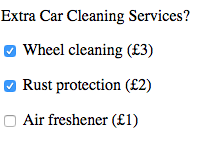

#Processing the values in checkboxes 

We've seen how to access checkbox individual checkbox form let's consider how we can actual evaluate how we can evaluate if a checkbox has been selected by the user:

Consider the car rental checkbox that we've been working with: 


```html
	<form  id="carRental">
            <p>Extra Car Cleaning Services?</p>    
            <p><input type="checkbox" name="extras" value="wheelCleaning"> Wheel cleaning (£3) </p>
            <p><input type="checkbox" name="extras" value="rustProtection">  Rust protection (£2) </p>
            <p><input type="checkbox" name="extras" value="airFreshner">  Air freshener (£1) </p>
    </form>
```

>> HTML




Now we know how to access each element, evaluating if a checkbox has been checked is trivial. We can simply use the `.checked` attribute 

```javascript
   var form  = document.getElementById("carRental");
   console.log(form.extras[0].checked)  // will return true 
   console.log(form.extras[1].checked)  // will return true 
   console.log(form.extras[2].checked)  // will return false 
```

Above, is a very simple example , we've just checked to see if a checkbox is checked. In reality you'd carry action or a set of actions based on the checked state of a check box:

```javascript

	if (form.extras[0].checked) {
	   console.log("you've selected wheel cleaning");
	}	
	if (form.extras[1].checked) {
	   console.log("you've selected wheel cleaning");
	}	
	if (form.extras[2].checked) {
	  console.log("you've selected rust protection");
	}
	
	if (form.extras[2].checked) {
	  console.log("you've selected air freshener");
	}

```


###The issue with the above example is were repeating a very similar instruction multiple times. Whenever you see this pattern occur, you should consider using a loop.
