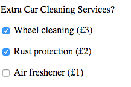

#Using a for loop to process check boxes 

A useful practical application of a for loop in javaScript is to iterate through check boxes. Given that a checkbox has multiple inputs and potentially multiple selections, we can't just access the selected values like we would for a single form input element. 


Consider the following form:

```html
	<form  id="carRental">
            <p>Extra Car Cleaning Services?</p>    
            <p><input type="checkbox" name="extras" value="wheelCleaning"> Wheel cleaning (£3) </p>
            <p><input type="checkbox" name="extras" value="rustProtection">  Rust protection (£2) </p>
            <p><input type="checkbox" name="extras" value="airFreshner">  Air freshener (£1) </p>
    </form>
```

>> HTML



Below is how we would access each of the checkbox inputs values. 

```javascript

	 var form  = document.getElementById("carRental");
    
     for(var i = 0; i < form.extras.length; i++) {
         if (form.extras[i].checked){
            //this block of code is executed 
            console.log("You selected" + form.extras[i].value);  
         }
     }

```

In the above example, we loop through our checkbox group and simply print out the **value** attribute if the checkbox has been selected. 


**Note**  `form.extras.length` returns the number of elements in our checkbox group, in this case it would be `3`. 


