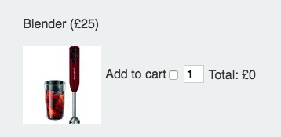

#How to Access Related HTML Elements 


 Consider the segment of HTML below, which represents our blender in the [ Stores exercise](https://sirus21.gitbooks.io/internet_technology_block_2/content/session17/exercise.html):
  
  
```html 
<label>Add to cart</label><input data-price="25" type="checkbox" name="product" value="blender">  
<input type="number"  value="1" name="blender-quantity"> 
<p>Total: <span  id="blender-total"> £0 </span>
``` 

>> HTML 



>> Browser View 


In the above example we need to write some javaScript that forfills the following functionality:


* User selects add to cart 
* A total is calculated by multiplying the price by the quantity 


[You've already seen how to loop through a set of checkboxes](https://sirus21.gitbooks.io/internet_technology_block_2/content/session17/using_a_for_loop_to_process_check_boxes.html), and if that checkbox is checked you've seen how to access it's data attribute and value.

**But how do we update related checkbox values?**  Let's have a look at how we might do this for our blender which is item `1` in our checkbox group:

```javascript
   ....
   
	var item = form.product[1].value;
	var quantity = parseInt(form[item + "-quantity"].value)
	var checkBoxValue = form.product[1].value; 
	var itemTotal = quantity * price;
	//update subtotal 
	subTotal = subTotal +  itemTotal;
	//update html
	document.getElementById(item + "-total").innerHTML = "£" + itemTotal;
	
	....
```

Hopefully you can see that we're taking advantage of consistent naming conventions. Let's break down what's happening here:

`var item = form.product[1].value;` item will hold the value of our product checkbox in this case `blender`

We can now take advantage of the fact that `<input type="number"  value="1" name="blender-quantity">` has the name `{{item}}-quantity`.  There's a alternative way of accessing forms that we can take advantage of here,  `form[feild_name]`. 

This is useful as we could reference our blender quantity form field like this:
 

`var quantity = parseInt(form[item + "-quantity"].value)` 


We can use  similar string concatenation method to set the innerHTML property of the total:

`document.getElementById(item + "-total").innerHTML = "£" + itemTotal;`

Again, a consistent naming convention has been used here. 

	


