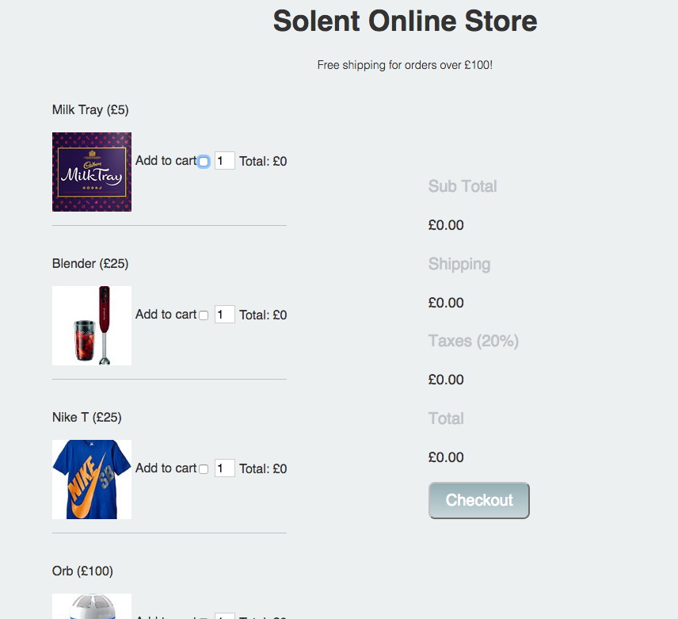

#Solent Stores - Shopping cart exercise (Continued)

The purpose of this exercise is to implement the javaScript on a shopping cart. The HTML has already been created for you. 

##1 Setup 

[Download the project source file from here](https://www.dropbox.com/s/8ntpmdz1x2um9sp/shopping_cart_exercise.zip?dl=0).  Open up index.html in your browser, you should be presented with the following website:.  Open up index.html in your browser, you should be presented with the following website:




##2  Add a data attribute to hold the price of each product

If you take a look at your source code for index.html you'll see that each product has a checkbox for the add to cart functionality.  Heres the one for our blender:   

```html
	
	<input type="checkbox" name="product" value="blender">  
	
```

At the a data attribute to hold the price of each item. For example our blender input would become:

```html

 	<input type="checkbox" name="product" data-price = "25" value="blender">  
	

```
             
             
##3 Our first bit of javaScript

Within index.html notice how we've included an external javaScript file and also added a `onLoad` event that calls a `main()` function. 

1. Open up `script/main.js` 
2. Within `main.js` add an`onChange` event listener to your form that runs the `formChangedFunction`
3. Check that the message is output to the console when the form changes

##4 Working out the main totals and shipping costs 
1. Within `main.js` `formChangeFunction` create the following variables:

```javascript

	 var form = document.getElementById("productForm"); 
    var subTotal = 0;
    var shipping = 0;
    var taxes = 0;
    var total = 0;
```

3)Next within `formChangedFunction` Create a for loop that loops through the `product` check list, if a product has been checked you should cast the `price` to a number and add it to the subtotal:

```javascript
	var numberTotal =  parseInt(form.product[i].dataset.price);
    subTotal = subTotal +  numberTotal;
```
Note, this is very similar to the in class example. 

3) After the loop, check to see if the `subTotal` is less than £100. If this is the case, set `shipping = £10`    
4) Set the variable `taxes =  20% of subTotal`  
5) Set the variable `total = subTotal + taxes + shipping`  
6) Set the inner HTML of each section in the summary table = to your new variable values:

```javascript
document.getElementById("sub-total").innerHTML =  "£" + subTotal;
 ...........
```


#5 Product totals and multiple items 

Implement the functionality to allow multiple the amount of each product to be increased. The total for each product should be displayed.   This is tricky, but let's take the blender as an example and considered its related elements:
	

```html
<input data-price="25" type="checkbox" name="product" value="blender">  
<input type="number"  value="1" name="blender-quantity"> 
<p>Total: <span  id="blender-total"> £0 </span> </p>
```

This naming convention is consistent for all the products, your solution will take advantage of this. 	

#6 Hide The Quantity form field 

Apply the the inline style attribute with the value `display:none` to hide each quantity field e.g. 


```html
<input type="number"  value="1" name="blender-quantity" style="display:none">  
```

Implement the functionality to show the quantity for a specific item when the user clicks the add to cart checkbox. Recall how to display and hide a html element, covered when [we used it to display or hide error messages](https://sirus21.gitbooks.io/internet_technology_block_2/content/session15/validation.html).  


You'll need to give each quantity input a unique id so you can reference them by id:

e.g. 

```html
<input type="number"  value="1"  id = "blender-quantity" name="blender-quantity" style="display:none">  
```


#7 Proceed to checkout 

1) Download the checkout form from [here](http://mycourse.solent.ac.uk/pluginfile.php/588411/mod_resource/content/1/session18-exercise.zip?forcedownload=1).

2) Place `checkout-form.html` in your root folder and `style2.css` in your css folder. 

3) Give the your form in index.html an action attribute so it submits to `checkout-form.html`.
	

	<form id="productForm" action="checkout-form.html">

4) Add some validation so the form only submits if at least one item is in the shopping cart.

5) You'll notice on the checkout page there's a section to display the total. This means you need to store the total when the form is submitted and recall it on the checkout page. This used to be tricky, however HTML5 allows us to use local storage, see if you can implement this functionality. 

```html
   localStorage.setItem('myName', 'joe'); // stores joe
   localStorage.getItem('myName'); // returns joe 
```

#8 Real time form validation

Implement real time form validation on the checkout form using the onBlur event. Use the technique [covered here](formValidationExample.md). 


